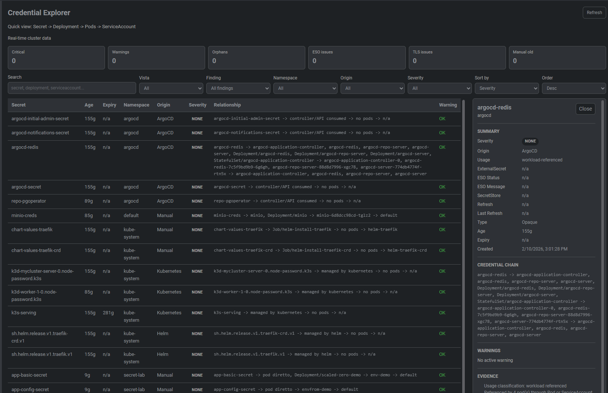

# Freelens Credential Explorer Extension

A Freelens extension (PoC) to quickly visualize the status of Kubernetes credentials with the relationship:

Secret → Deployment → Pods → ServiceAccount

## Overview

Provide an operational dashboard to answer these questions in seconds:

- How old is a Secret?
- When does it expire?
- In which namespace does it live?
- Where does it come from (Vault, External Secrets, manual)?
- Are there critical warnings?

## Current Status

This scaffold includes:

- Freelens extension structure (`main` + `renderer`)
- `Credential Explorer` page in the cluster menu
- Initial table with columns: Secret, age, expiry, namespace, origin, relationship, warning
- Filters by namespace, origin, and severity
- Sorting by severity, expiry, age, namespace, and secret
- Normalized severity (`none`, `info`, `warning`, `critical`) with badges
- Mock dataset for developing UI and logic without cluster dependency
- **TLS/SSL Certificate Support**: Automatic detection of `cert-manager` managed certificates with expiry tracking
  - Certificate expiry detection
  - Support for Kubernetes native TLS Secrets (`kubernetes.io/tls` type)

## Screenshot



## Project Structure

- `src/main/index.ts`: main extension entrypoint
- `src/renderer/index.tsx`: page registration and menu
- `src/renderer/CredentialExplorerPage.tsx`: initial UI
- `src/renderer/credential-store.ts`: mock adapter + indicator calculations
- `src/common/types.ts`: shared models

## Installation

Download the pre-built extension from the [latest release](https://github.com/bladepina/freelens-credential-explorer/releases):

```sh
# Download the tarball
wget https://github.com/bladepina/freelens-credential-explorer/raw/main/freelens-credential-explorer-0.1.0.tgz

# Or use curl
curl -L -O https://github.com/bladepina/freelens-credential-explorer/raw/main/freelens-credential-explorer-0.1.0.tgz
```

Load it in Freelens from the Extensions menu.

## Local Build

Prerequisites:

- Node.js 24+
- pnpm

Commands:

```sh
pnpm install
pnpm build
pnpm pack
```

The generated tarball can be loaded in Freelens from Extensions.
